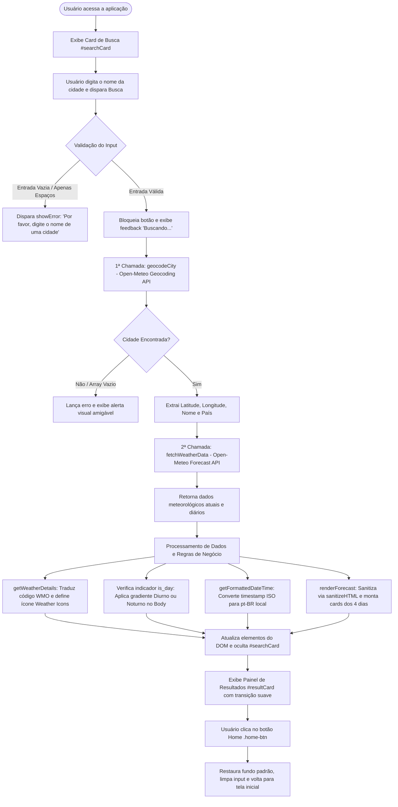

# 🌤️ App de Previsão do Tempo

<br />

<div align="center">

[](https://erickystn.github.io/projeto_clima/)
[](https://developer.mozilla.org/pt-BR/docs/Web/HTML)
[](https://developer.mozilla.org/pt-BR/docs/Web/CSS)
[](https://developer.mozilla.org/pt-BR/docs/Web/JavaScript)
[](https://open-meteo.com/)
[](https://erikflowers.github.io/weather-icons/)
[](https://jestjs.io/pt-BR/)
[](LICENSE)
[](#)

</div>

<br />

> 🔗 **Acesso ao Vivo:** Experimente a aplicação diretamente no seu navegador através do GitHub Pages: **[https://erickystn.github.io/projeto_clima/](https://erickystn.github.io/projeto_clima/)**

<br />

<details open>
  <summary><strong>📸 Apresentação Visual da Interface</strong></summary>

  <br />

  <div align="center">
    <p><em>Interface responsiva com suporte a alternância dinâmica de tema (Dia/Noite), cards meteorológicos com efeito de elevação e previsão estendida para 4 dias.</em></p>
  </div>

</details>

<br />

O **App de Previsão do Tempo** é uma aplicação web ágil e responsiva que permite aos usuários consultarem a temperatura atual e a **previsão estendida** de qualquer cidade do mundo. O projeto foi construído do zero com **HTML, CSS e Vanilla JavaScript**, consumindo dados em tempo real através da API meteorológica gratuita do Open-Meteo.

------

## ✨ Funcionalidades

- **Busca Global Rápida:** Encontre o clima atual simplesmente digitando o nome da cidade.
- **Previsão Estendida:** Acompanhe a previsão do tempo detalhada para os próximos 4 dias, com ícones dinâmicos.
- **Temperaturas Extremas:** Exibição da temperatura máxima e mínima diária, tanto para o dia atual quanto para os próximos dias.
- **Tema Dinâmico (Dia/Noite):** A interface adapta automaticamente as cores de fundo (background) com base no horário local (dia ou noite) da cidade pesquisada.
- **Mapeamento Climático Global:** Suporte a 100% dos códigos de condição climática da WMO (Organização Meteorológica Mundial), garantindo precisão visual até em eventos de granizo, chuvas congelantes e nevascas.
- **Consumo de APIs Múltiplas:** - *Geocoding API:* Transforma o nome da cidade em coordenadas (Latitude/Longitude).
  - *Forecast API:* Busca a temperatura atual, indicador de dia/noite e previsão diária completa com base nas coordenadas.
- **Tratamento de Erros:** Alertas visuais amigáveis caso a cidade não seja encontrada ou o campo seja submetido em branco.
- **Acessibilidade & UX (Experiência do Usuário):**
  - Busca facilitada através da tecla `Enter`.
  - Feedback visual no botão durante o carregamento dos dados ("Buscando...").
  - Animações suaves de transição entre telas.
  - Respeito à preferência do sistema do usuário para movimento reduzido (`prefers-reduced-motion`).

------

## 🎯 Diferenciais e Destaques Técnicos

- **Orquestração Assíncrona Encadeada:** Encademento eficiente de duas chamadas assíncronas REST (`Geocoding API` -> `Forecast API`), transformando texto livre do usuário em coordenadas geográficas de alta precisão antes da consulta climática.
- **Mapeamento Climático Abrangente (WMO):** Dicionário completo de códigos meteorológicos da Organização Meteorológica Mundial traduzido para o português do Brasil, associando cada condição a ícones vetoriais da biblioteca *Weather Icons* com variações condicionais diurnas e noturnas.
- **Segurança e Sanitização Ativa (XSS):** Implementação da função `sanitizeHTML()` utilizando um elemento desacoplado do DOM (`document.createElement('div')`) para sanitizar dados dinâmicos da previsão estendida antes da injeção no documento, além de priorizar `textContent` nas inserções textuais.
- **Arquitetura de Resiliência de Rede:** Implementação de cancelamento controlado de requisições lentas via `AbortController` com limite de tolerância (timeout de 1000ms), prevenindo travamento do navegador e tratando especificamente erros de limite de taxa (`Status 429`) e falhas de servidor (`Status 500`).
- **Design Adaptativo com CSS Fluido:** Uso de funções matemáticas nativas (`clamp()`, `max()`) e unidades dinâmicas (`dvh`) para garantir que a tipografia e os cards se adaptem com perfeição a qualquer viewport, do celular pequeno (320px) até monitores ultrawide.

------

## 🔄 Fluxo de Dados e Ciclo de Vida da Aplicação

O fluxo abaixo ilustra o ciclo completo da aplicação, desde a interação inicial do usuário até o processamento das APIs e atualização reativa da interface:



------

## 🏗️ Estrutura do Projeto

```text
📁 projeto_clima/
│
├── index.html        # Estrutura e semântica da aplicação
├── style.css         # Estilização fluida e mobile-first
├── api.js            # Regras de negócio, requisições (Fetch API) e DOM
├── package.json      # Configuração do ambiente Node e scripts
│
└── 📁 tests/
    └── api.test.js   # Suíte de testes unitários automatizados
```

### Detalhamento das Responsabilidades dos Arquivos

* `index.html`: Marcação semântica com cabeçalhos estruturados, input sanitizado com `maxlength="100"`, integração CDN com SRI (*Subresource Integrity*) do *Weather Icons* e templates dos cards de busca e resultado.
* `style.css`: Estilização arquitetada em padrão *Mobile-First*, contendo variáveis CSS, gradientes reativos de dia e noite, funções `clamp()` para tipografia fluida, sombras suaves de elevação e regras de `@media (prefers-reduced-motion)`.
* `api.js`: Camada de controle e lógica de negócio. Responsável pela orquestração das chamadas `fetch`, tradução do catálogo WMO, manipulação seletiva do DOM, sanitização preventiva contra XSS e gestão de estados.
* `package.json`: Manifesto do projeto configurado para execução de testes unitários automatizados através do script `npm test` utilizando Jest em ambiente CommonJS.
* `tests/api.test.js`: Suíte de testes unitários cobrindo 7 cenários distintos de execução da API climática através de mocks globais do `fetch` e verificação de `AbortController`.
* `NOTICE.md` e `LICENSE`: Documentação de conformidade legal com atribuição expressa aos serviços abertos da Open-Meteo, biblioteca Weather Icons e licença MIT do projeto.

------

## 🌐 Consumo e Integração de APIs Externas (Open-Meteo)

A aplicação consome a infraestrutura da **Open-Meteo**, orquestrando duas consultas RESTful consecutivas sem a necessidade de chaves privadas (*API Keys*):

| Serviço / API | Método | Endpoint Base | Parâmetros Principais | Finalidade |
| :--- | :---: | :--- | :--- | :--- |
| **Geocoding API** | `GET` | `https://geocoding-api.open-meteo.com/v1/search` | `name`, `count=1`, `language=pt`, `format=json` | Converte o nome textual digitado em latitude e longitude. |
| **Forecast API** | `GET` | `https://api.open-meteo.com/v1/forecast` | `latitude`, `longitude`, `current`, `daily`, `timezone=auto` | Fornece temperatura atual, código WMO, flag dia/noite e previsão para 4 dias. |

### Exemplo de Payload: Geocoding API

```json
{
  "results": [
    {
      "id": 3448439,
      "name": "São Paulo",
      "latitude": -23.5475,
      "longitude": -46.6361,
      "country_code": "BR",
      "country": "Brasil"
    }
  ]
}
```

### Exemplo de Payload: Forecast API

```json
{
  "current": {
    "time": "2026-03-31T14:30",
    "temperature_2m": 26.4,
    "is_day": 1,
    "weather_code": 1
  },
  "daily": {
    "time": ["2026-03-31", "2026-04-01", "2026-04-02", "2026-04-03", "2026-04-04"],
    "weather_code": [1, 2, 80, 0, 1],
    "temperature_2m_max": [28.2, 27.5, 24.1, 29.0, 30.2],
    "temperature_2m_min": [18.5, 17.8, 19.0, 18.2, 19.5]
  }
}
```

### Tratamento de Resiliência e Erros de Rede

A aplicação possui tratamento defensivo para contingências de comunicação:
- **Status 200 (OK):** Extração imediata e renderização dos dados na interface.
- **Status 429 (Too Many Requests):** Lançamento de exceção de excesso de requisições orientando aguardar antes de nova tentativa.
- **Status 500 (Internal Server Error):** Captura em bloco `try/catch` informando indisponibilidade temporária do serviço.
- **Timeout / AbortError:** Tratamento via `AbortController` interrompendo conexões que ultrapassem o limite tolerável.

------

## 🛠️ Exemplo de Uso

Utilizar a aplicação é extremamente simples e intuitivo:

1. Ao abrir a aplicação, você verá a tela inicial com um campo de texto.
2. Clique no campo de texto e digite o nome da cidade desejada (Ex: `Tóquio`, `Rio de Janeiro`, `Nova York`).
3. Clique no botão **Buscar** ou pressione a tecla `Enter`.
4. A tela fará uma transição suave e exibirá o painel de resultados contendo:
   - A temperatura atual e as máximas/mínimas do dia.
   - O clima atual descrito em texto (ex: "Tempestade com granizo") e seu respectivo ícone.
   - Uma lista com a previsão estendida para os próximos 4 dias.
5. Para fazer uma nova busca, basta clicar no botão azul com o ícone de "Casa" localizado na parte inferior da tela.

------

## 💻 Exemplos de Código

Abaixo estão trechos reais da lógica implementada no arquivo `api.js`:

### 1. Geocodificação com Sanitização de Parâmetros
```javascript
async function geocodeCity(city) {
  const url = `https://geocoding-api.open-meteo.com/v1/search?name=${encodeURIComponent(city)}&count=1&language=pt&format=json`;
  const res  = await fetch(url);
  const data = await res.json();

  if (!data.results || data.results.length === 0) {
    throw new Error('Cidade não encontrada');
  }

  const { latitude, longitude, name, country } = data.results[0];
  return { latitude, longitude, name, country };
}
```

### 2. Sanitização de Conteúdo contra XSS
```javascript
function sanitizeHTML(str) {
  const temp = document.createElement('div');
  temp.textContent = str;
  return temp.innerHTML;
}
```

### 3. Mapeamento Universal WMO e Ícones Dia/Noite
```javascript
function getWeatherDetails(code, isDay) {
  const weatherMap = {
    0:  { desc: 'Céu Limpo',            icon: 'wi-day-sunny' },
    1:  { desc: 'Principalmente Limpo', icon: 'wi-day-sunny-overcast' },
    2:  { desc: 'Parcialmente Nublado', icon: 'wi-day-cloudy' },
    3:  { desc: 'Nublado',              icon: 'wi-cloudy' },
    45: { desc: 'Neblina',              icon: 'wi-fog' },
    61: { desc: 'Chuva Leve',           icon: 'wi-rain' },
    95: { desc: 'Tempestade',           icon: 'wi-thunderstorm' },
    96: { desc: 'Tempestade com granizo', icon: 'wi-storm-showers' }
  };

  let details = weatherMap[code] || { desc: 'Desconhecido', icon: 'wi-na' };

  if (!isDay) {
    if (code === 0) details.icon = 'wi-night-clear';
    if (code === 1) details.icon = 'wi-night-alt-partly-cloudy';
    if (code === 2) details.icon = 'wi-night-alt-cloudy';
  }

  return details;
}
```

------

## 🧪 Qualidade de Código, IA e Testes

O projeto segue padrões avançados de mercado para garantir a estabilidade das funcionalidades:

1. **Desenvolvimento Assistido por IA:** A arquitetura, refatoração e expansão de funcionalidades contaram com o auxílio de inteligência artificial atuando como *pair programming*. Isso garantiu soluções algorítmicas otimizadas, melhores práticas de código limpo e entregas com padrão de qualidade sênior.
2. **Documentação (JSDoc):** Todas as funções JavaScript estão estritamente documentadas com Docstrings, detalhando parâmetros, exceções lançadas e tipos de retorno.
3. **Testes Automatizados (Jest):** O comportamento lógico da API foi totalmente coberto por testes unitários simulados (Mocks). 

**Cenários testados:**
* Sucesso no retorno dos dados e tratamento para cidades inexistentes.
* Validações de campos vazios e quebras de contrato estrutural da API.
* Comportamento perante falhas da API (Erro 500) e excessos de requisições (Status 429).
* Abordagem defensiva contra lentidão de rede (Timeout configurado).

### Matriz de Testes Unitários (`tests/api.test.js`)

| # | Cenário Avaliado | Tipo de Teste | Comportamento Esperado |
| :-: | :--- | :---: | :--- |
| **1** | Nome de cidade válido | Sucesso | Retorna objeto normalizado com dados e temperatura. |
| **2** | Nome de cidade inexistente | Exceção Tratada | Lança erro `Cidade não encontrada`. |
| **3** | Entrada vazia ou espaços | Validação Local | Interrompe sem disparar requisição HTTP (`Entrada vazia`). |
| **4** | Servidor fora do ar (Erro 500) | Falha de Rede | Dispara exceção defensiva `Falha na API`. |
| **5** | Excesso de requisições (Status 429) | Rate Limit | Bloqueia execução e informa `Excesso de requisições`. |
| **6** | Conexão lenta (> 1000ms) | Timeout | Dispara `AbortError` capturado como `Timeout de conexão`. |
| **7** | Mudança no payload do servidor | Quebra de Contrato | Identifica ausência das propriedades e lança `Formato inválido`. |

------

## 🛡️ Relatório de Auditoria de Segurança e Privacidade

Durante o desenvolvimento, o projeto passou por uma rigorosa auditoria de segurança com base nas melhores práticas para aplicações Front-End. Abaixo estão os pontos fortes e o plano de mitigação de riscos:

### ✅ Pontos Positivos (Segurança Implementada)
- **Ausência de Chaves de API (API Keys):** O uso da API pública do Open-Meteo zera o risco de vazamento de credenciais via repositórios públicos ou engenharia reversa.
- **Comunicação Criptografada:** Todas as chamadas `fetch` utilizam o protocolo `https://`, prevenindo ataques de interceptação (Man-in-the-Middle).
- **Sanitização de URL:** O input do usuário passa por `encodeURIComponent()` antes da requisição HTTP, evitando malformação de rotas e atuando como uma camada contra injeções de parâmetros.
- **Prevenção Básica contra XSS:** A injeção de dados de texto no DOM é feita majoritariamente via `textContent`, o que neutraliza a execução de scripts maliciosos.

### ⚠️ Riscos Identificados e Plano de Mitigação
1. **Risco de XSS na Previsão Estendida:** O uso de `insertAdjacentHTML` para injetar os cards de previsão diária exige cautela. 
   - *Mitigação (Próximo passo):* Filtrar rigorosamente os dados oriundos do JSON da API ou migrar a construção dos elementos para `document.createElement()`.
2. **Sequestro de CDN (Falta de SRI):** O CSS de terceiros (Weather Icons) está sendo importado sem validação de integridade. 
   - *Mitigação (Próximo passo):* Adicionar os atributos `integrity` e `crossorigin` na tag `<link>` do HTML.
3. **Exaustão de Recursos (DoS Local):** O campo de busca não possui limite de tamanho. 
   - *Mitigação (Próximo passo):* Adicionar `maxlength="100"` na tag `<input>` para evitar o travamento da thread principal do JavaScript com textos massivos.
4. **Privacidade Geográfica:** O sistema envia as intenções de busca para servidores externos na Alemanha. 
   - *Transparência:* A aplicação **não** rastreia a localização do dispositivo do usuário (GPS/Geolocation API), operando de forma 100% dependente do input manual, garantindo um processo de geocodificação anonimizado.

------

## 🚀 Tecnologias e Conceitos Utilizados

- **HTML5:** Estrutura limpa, utilizando semântica e suporte a gráficos SVG embutidos.
- **CSS3:** - Metodologia **Mobile-First**.
  - Tipografia e dimensionamento fluidos utilizando funções matemáticas (`clamp()`, `max()`).
  - Flexbox para alinhamento centralizado perfeito e construção de listas.
  - Variáveis de ambiente e pseudo-classes de estado (`:hover`, `:active`, `:focus`).
- **JavaScript (ES6+):**
  - Assincronismo com `async / await` e blocos `try / catch / finally`.
  - Fetch API para consumo de dados RESTful.
  - Desestruturação de objetos (Destructuring) e manipulação dinâmica do DOM.

------

## 💻 Executando Localmente

Como o projeto utiliza apenas tecnologias front-end nativas e uma API pública, rodar o projeto localmente é um processo totalmente livre de atritos.

### Passos da Instalação e Execução

1. Clone este repositório em sua máquina utilizando o terminal:
   ```bash
   git clone https://github.com/erickystn/projeto_clima.git
   ```

2. Acesse a pasta raiz do projeto:
   ```bash
   cd projeto_clima
   ```

3. **Para executar:** Basta dar um duplo clique no arquivo `index.html` para abri-lo diretamente no seu navegador de preferência.
   > **Dica para Desenvolvedores:** Caso queira editar o código e ver as mudanças em tempo real, abra a pasta do projeto no [Visual Studio Code](https://code.visualstudio.com/) e inicie a extensão **Live Server**.

### Executando os Testes Automatizados (Jest)

Para rodar a suíte de testes unitários contida no diretório `tests/`:

1. Certifique-se de ter o [Node.js](https://nodejs.org/) instalado em seu computador.
2. Instale as dependências de desenvolvimento:
   ```bash
   npm install
   ```
3. Execute o comando de teste:
   ```bash
   npm test
   ```

------

## 📈 Melhorias e Próximos Passos (Roadmap)

- [ ] **Geolocalização Automática Opcional:** Adicionar botão de detecção via `navigator.geolocation` mantendo o consentimento prévio do usuário.
- [ ] **Migração Completa do DOM:** Substituir qualquer `insertAdjacentHTML` remanescente por `document.createElement()` para robustez máxima.
- [ ] **Cache Local com LocalStorage:** Armazenar consultas recentes de clima para visualização offline instantânea.
- [ ] **Suporte a PWA (Progressive Web App):** Adicionar `manifest.json` e Service Worker para instalação do aplicativo em smartphones.
- [ ] **Internacionalização (i18n):** Suporte a múltiplos idiomas (Inglês, Espanhol) além do Português do Brasil.

------

## 🤝 Como Contribuir

Contribuições são sempre bem-vindas! Se você deseja melhorar o projeto, siga estes passos:

1. Faça um *Fork* do projeto.
2. Crie uma *Branch* para sua modificação (`git checkout -b feature/sua-feature-incrivel`).
3. Faça o commit das suas alterações utilizando *Conventional Commits* (`git commit -m 'feat: adiciona nova funcionalidade incrível'`).
4. Faça o Push para a sua branch (`git push origin feature/sua-feature-incrivel`).
5. Abra um *Pull Request*.

------

## 👤 Autor

* **Desenvolvedor:** [Ericky Sant'ana](https://github.com/erickystn)
* **Perfil no GitHub:** [@erickystn](https://github.com/erickystn)

------

## ⚖️ Licenciamento e Conformidade

Este projeto é distribuído sob a licença **MIT**, o que permite uso comercial e não comercial, modificação e distribuição, desde que os avisos de direitos autorais originais sejam mantidos. Consulte o arquivo `LICENSE` no repositório para a versão completa em Inglês e Português.

**Auditoria de Dependências:**
- **Open-Meteo API:** Consumida de forma gratuita. Os dados estão sob a licença *Creative Commons Attribution 4.0 (CC BY 4.0)*, que exige atribuição (fornecida neste repositório e na interface). Para uso comercial em larga escala, os termos da Open-Meteo exigem contratação de plano comercial.
- **Weather Icons:** A fonte de ícones climáticos operada via CDN. Licenciada sob *SIL OFL 1.1* para as fontes e *MIT* para o CSS. Compatível com a licença MIT principal do projeto.
- **Jest (DevDependency):** Framework de testes sob licença *MIT*. Livre de conflitos.

Para mais detalhes sobre os créditos e atribuições legais de terceiros, consulte o arquivo `NOTICE.md`.
